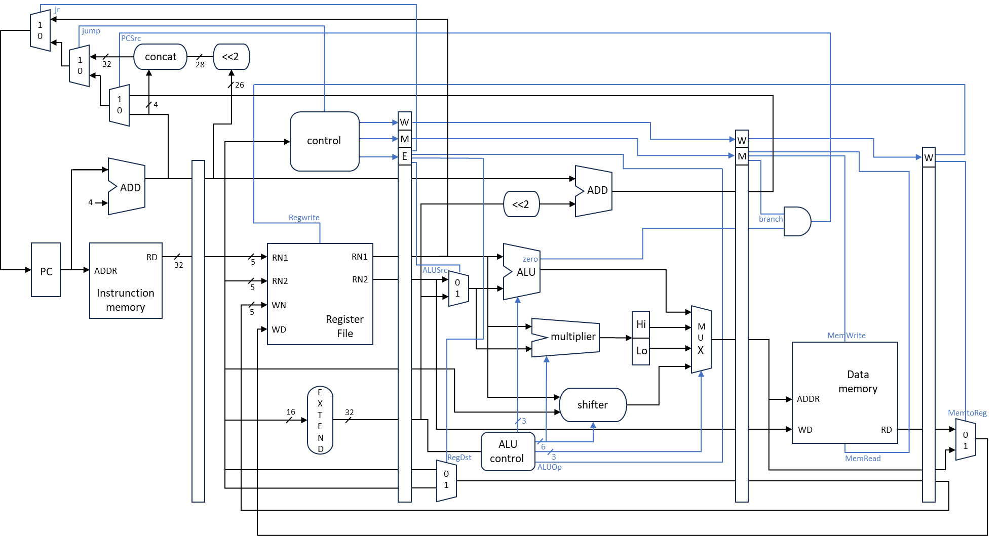
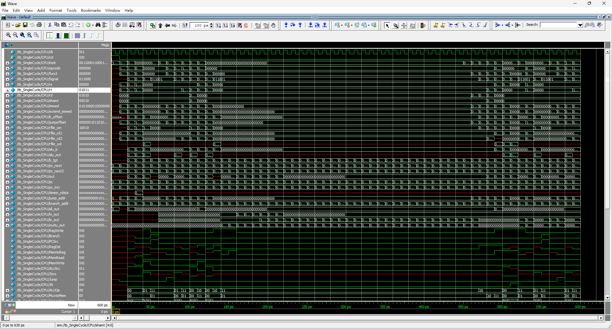
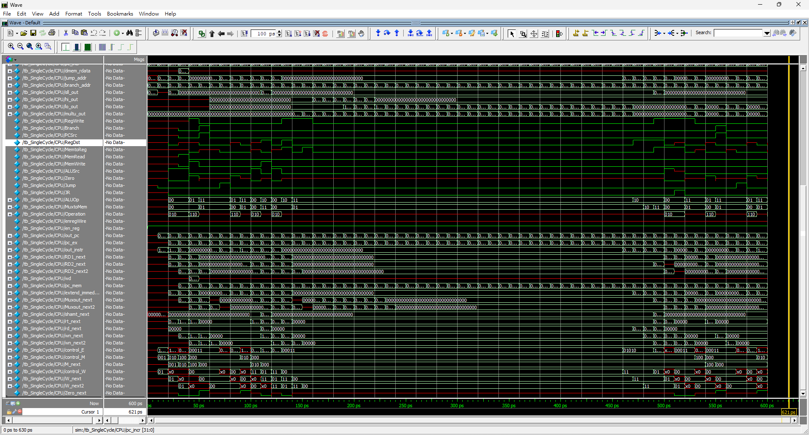
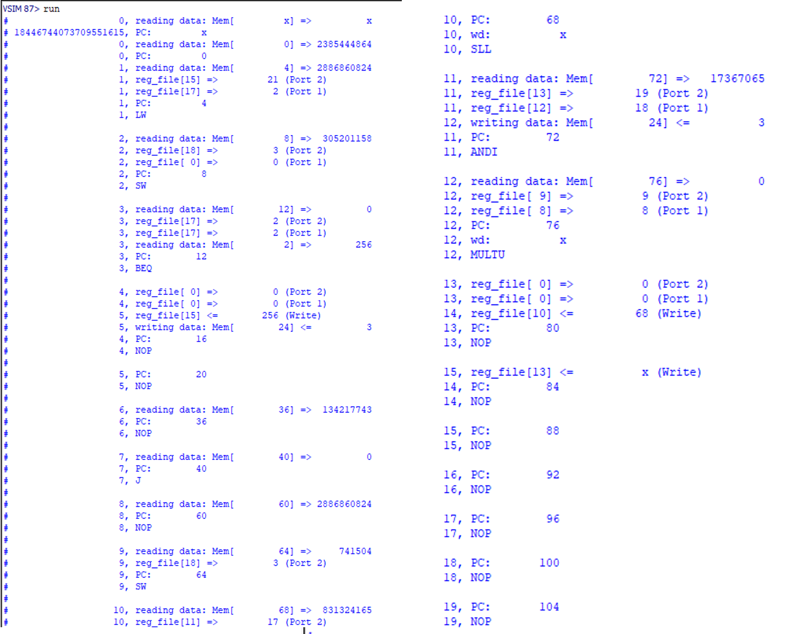

# Pipelined CPU 實作

以 Verilog HDL 搭配 ModelSim 模擬器實作一個五階段 pipeline 的 MIPS-Lite CPU。  

參考課本 Chapter 4 與課程講義之 Pipelined Datapath，設計一個 Pipelined 
MIPS-Lite CPU。

 

# 實現指令
完成下列16道指令  
a) Integer Arithmetic: **add, sub, and, or, sll, slt, andi**  
b) Integer Memory Access:  **lw, sw**  
c) Integer Branch: beq, **j, jr**  
d) Integer Multiply/Divide: **multu**  
e) Other Instructions: **mfhi, mflo, nop**  

 

# 設計重點說明

 

## ALU

### ALU
- **Input:** `RD1_next` (32 bits), `alu_b` (32 bits)  
- **Output:** `out` (`alu_out`)  

功能說明：呼叫 ALU-Bit-Slice，依序處理 32 位元的 `RD1_next` 和 `alu_b`，並將回傳值存入 `temp`。將 `temp` 指派給 `out`。若 signal 為 `101010` (`slt`)，則檢查 `temp[31]` 是否為 1（即為負數），若為負則 `out = alu_b`，否則為 `RD1_next`。

### 1-bit ALU
- **Input:** `a` (1 bit), `b` (1 bit), `invertb` (1 bit), `carryIn` (1 bit)  
- **Output:** `out` (1 bit), `carryOut` (1 bit)  

功能說明：計算 AND、OR 結果，並呼叫 FA 執行 ADD 或 SUB，依據 signal 決定輸出為何。

### FA (全加器)
- **Input:** `a` (1 bit), `b` (1 bit), `carryIn` (1 bit)  
- **Output:** `sum` (1 bit), `carryOut` (1 bit)

 

## Multiplier

- **Input:** `RD1_next` (32 bits), `alu_b` (32 bits)  
- **Output:** `multu_out` (64 bits)  

功能說明：若 signal 為乘法指令，重複 32 次操作，根據 LSB 判斷是否加上被乘數。將結果逐步右移累加，最後將高 32 位元與低 32 位元合併為 `multu_out`。

 

## Shifter

### Shifter
- **Input:** `RD2_next` (32 bits), `shamt_next` (32 bits)  
- **Output:** `sll_out` (32 bits)  

功能說明：根據 `shamt_next` 中每一 bit 決定左移的位數（1、2、4、8），移位後用 0 補齊空位。

### Mux_2to1
- **Input:** `in0` (1 bit), `in1` (1 bit), `sel` (1 bit)  
- **Output:** `out` (1 bit)  

功能說明：若 `sel = 1` 則輸出 `in1`，否則輸出 `in0`。

 

## HiLo

- **Input:** `multu_out` (64 bits)  
- **Output:** `Hi` (32 bits), `Lo` (32 bits)  

功能說明：將 `multu_out` 高 32 bits 放入 `Hi`，低 32 bits 放入 `Lo`。

 

## Mux

- **Input:** `ALU` (32 bits), `Hi` (32 bits), `Lo` (32 bits), `SHT` (32 bits)  
- **Output:** `out` (32 bits)  

功能說明：根據 signal 決定輸出為 `ALU`、`Hi`、`Lo` 或 `SHT`。

 

## IFID

- **Input:** `pc_incr` (32 bits), `instr` (32 bits)  
- **Output:** `out_pc` (32 bits), `out_instr` (32 bits)  

功能說明：暫存當前 Cycle 的 PC 和指令，供下一個 pipeline 階段使用。

 

## IDEX

- **Input:**  
  - `rt` (5 bits), `rd` (5 bits)  
  - `rfile_rd1` (32 bits), `rfile_rd2` (32 bits)  
  - `extend_immed` (32 bits), `out_pc` (32 bits), `shamt` (5 bits)  
  - `control_E` (5 bits), `control_M` (3 bits), `control_W` (2 bits)  

- **Output:**  
  - `rt_next` (5 bits), `rd_next` (5 bits)  
  - `RD1_next` (32 bits), `RD2_next` (32 bits)  
  - `extend_immed_next` (32 bits), `pc_ex` (32 bits)  
  - `M_next` (3 bits), `W_next` (2 bits), `shamt_next` (5 bits)  
  - `ALUSrc` (1 bit), `RegDst` (1 bit), `JR` (1 bit), `ALUOp` (3 bits)

功能說明：儲存當前 Register 值與控制訊號，將 `control_E` 拆為 `ALUSrc`、`RegDst`、`JR`、`ALUOp`。

 

## EXMEM

- **Input:**  
  - `b_tgt` (32 bits), `out` (32 bits), `RD2_next` (32 bits), `rfile_wn` (5 bits)  
  - `M_next` (3 bits), `W_next` (2 bits), `Zero` (1 bit)  

- **Output:**  
  - `pc_mem` (32 bits), `Muxout_next` (32 bits), `RD2_next2` (32 bits), `wn_next` (5 bits)  
  - `W_next2` (2 bits), `Zero_next` (1 bit)  
  - `Branch` (1 bit), `MemWrite` (1 bit), `MemRead` (1 bit)

功能說明：將 `control_M` 拆分為 `Branch`、`MemWrite`、`MemRead`，並傳遞至下一階段。

 

## MEMWB

- **Input:**  
  - `W_next2` (2 bits), `wn_next` (5 bits), `Muxout_next` (32 bits), `dmem_rdata` (32 bits)  

- **Output:**  
  - `wd` (32 bits), `Muxout_next2` (32 bits), `wn_next2` (5 bits)  
  - `MemtoReg` (1 bit), `RegWrite` (1 bit)

功能說明：將 `control_W` 拆為 `MemtoReg` 與 `RegWrite`，供後續寫入 Register 使用。

 

# Datapath

  
 

# waveform

 

# result

